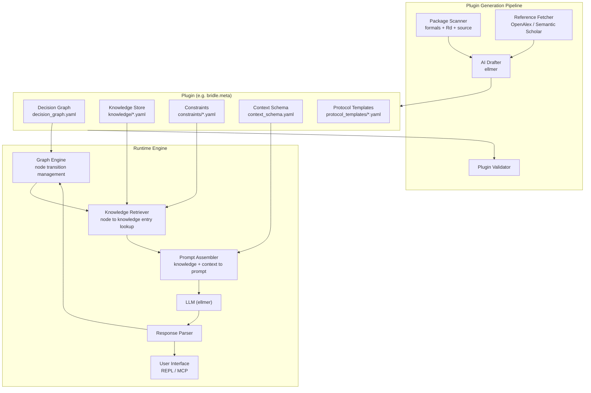

# bridle

[](https://lifecycle.r-lib.org/articles/stages.html#experimental)
[](https://www.repostatus.org/#wip)
[](https://opensource.org/licenses/MIT)
[](https://github.com/k-shibuki/bridle/actions/workflows/ci.yaml)
[](https://github.com/k-shibuki/bridle/actions/workflows/R-CMD-check.yaml)

Knowledge harness framework that structures R package expertise for LLM-guided statistical analysis

---

## Statement of Need

When LLMs drive statistical analysis, the entire decision chain becomes probabilistic. Choosing effect measures, specifying models, assessing heterogeneity — as these decisions cascade, small uncertainties at each step accumulate, making it impossible to guarantee methodological correctness. LLMs are generally accurate at local judgments ("A or B in this situation?") but unreliable at designing the overall flow ("which decisions, in what order?").

Moreover, statistical analysis requires **pre-specification (protocols)**. In meta-analysis, the analytical approach must be fixed in advance with a clear understanding of models, protocols, and the direction of analysis (what is confirmatory vs. exploratory). R packages such as meta and metafor offer rich options, but an LLM cannot make appropriate choices unless it understands the "meaning" and "applicability conditions" of those options.

bridle generates **harnesses** that structure R package knowledge and deliver it to the LLM. The LLM presents considerations and suggestions based on this knowledge base. The user makes the final call. We use the horse's (LLM's) power, but the rider (harness) sets the direction. The name bridle derives from this control structure.

## Architecture

bridle has two functions: a **plugin generation pipeline** (a build tool that semi-automatically generates knowledge plugins from R packages) and a **runtime engine** (an execution environment that controls the dialogue between the LLM and the user based on plugin knowledge).

### Overall Structure



The **plugin generation pipeline** analyzes an R package's `formals()`, Rd files, and source code, then combines the results with literature information to semi-automatically generate a knowledge plugin.

A **plugin** is a self-contained knowledge base for a single R package. It includes a decision graph that defines the order of decisions, knowledge entries for each decision point, and technical constraints. Most content is LLM-drafted + expert-reviewed.

The **runtime engine** follows the decision graph to control the conversation flow, supplying relevant knowledge to the LLM at each decision point.

## Plugin Design

Plugins are defined **per R package**. For example, `bridle.meta` is the knowledge base for the meta package, and `bridle.metafor` is the knowledge base for the metafor package; each functions independently. A plugin holds both methodological knowledge and API mapping in a self-contained manner.

### Directory Layout

```
bridle.meta/
├── inst/
│   └── bridle/
│       ├── manifest.yaml              # plugin metadata
│       ├── decision_graph.yaml        # decision flow definition
│       ├── context_schema.yaml        # analysis context schema
│       ├── protocol_templates/
│       │   ├── pairwise_binary.yaml
│       │   └── pairwise_continuous.yaml
│       ├── knowledge/
│       │   ├── effect_measures.yaml
│       │   ├── tau2_estimators.yaml
│       │   └── ...
│       └── constraints/
│           └── technical.yaml         # auto-generated by scan_package
```

### Decision Graph

The decision graph defines a flow that efficiently narrows the parameter space. Each node corresponds to a decision point, and transition conditions determine the next node. Four node types exist: `context_gathering`, `decision`, `execution`, and `diagnosis`. Loops allow re-running with changed parameters (e.g., sensitivity analysis).

```yaml
# inst/bridle/decision_graph.yaml (excerpt)
graph:
  entry_node: sm_selection
  nodes:
    sm_selection:
      type: decision
      topic: effect_measures
      parameter: sm
      transitions:
        - to: method_selection
          always: true
```

Full schema: [`docs/schemas/decision_graph.schema.yaml`](docs/schemas/decision_graph.schema.yaml). Design rationale: [ADR-0002](docs/adr/0002-decision-graph-flow-control.md).

### Knowledge Format

Knowledge is **descriptive**: instead of "recommend PM," it states "PM has these properties, supported by these references." The LLM generates context-dependent recommendations from this. Each entry has a `when` condition (natural language for expert review) and an optional `computable_hint` (R expression evaluated at runtime).

```yaml
# inst/bridle/knowledge/tau2_estimators.yaml (excerpt)
entries:
  - id: tau2_small_k
    when: "number of studies is small (fewer than 5)"
    computable_hint: "k < 5"
    properties:
      - "PM is robust with small samples"
      - "REML is prone to convergence issues"
    references:
      - "Veroniki AA, et al. (2016) Res Synth Methods"
```

Full schema: [`docs/schemas/knowledge.schema.yaml`](docs/schemas/knowledge.schema.yaml). Condition semantics: [ADR-0003](docs/adr/0003-when-condition-semantics.md).

### Technical Constraints

`constraints/technical.yaml` is auto-generated by `scan_package()`. It captures inter-parameter constraints (e.g., "Peto method forces OR as effect measure") and valid value enumerations extracted from formals, Rd, and source code. See [`docs/schemas/constraints.schema.yaml`](docs/schemas/constraints.schema.yaml) and [ADR-0004](docs/adr/0004-scanner-three-layer-analysis.md) for details.

## Plugin Generation Pipeline

The pipeline, provided by bridle core, generates most of a plugin's content:

1. **`scan_package("meta")`** — Analyzes the R package in three layers: formals (dependency graphs), Rd (valid values, descriptions), and source code (match.arg, stop/warning constraints). See [ADR-0004](docs/adr/0004-scanner-three-layer-analysis.md).
2. **`fetch_references(scan_result)`** — Resolves DOIs and retrieves abstracts via OpenAlex (primary) and Semantic Scholar (fallback) APIs. See [ADR-0010](docs/adr/0010-reference-api-openalex-semantic-scholar.md).
3. **`draft_knowledge(scan_result, references)`** — Uses ellmer to draft the decision graph, knowledge entries, and constraints from scan results + literature.
4. **Expert Review** — Direct YAML editing: verifying decision ordering, adding competing views, refining conditions, supplementing references.
5. **`validate_plugin("bridle.meta")`** — Checks coverage, consistency, constraint validity, and node reachability.

Knowledge quality improves incrementally: formals only → abstracts added → full text added → expert review.

## Runtime Engine

The runtime engine controls the dialogue according to the plugin's decision graph:

- **Graph Engine** — Manages node transitions; evaluates `computable_hint` R expressions when possible, otherwise delegates to the LLM. Supports loops for sensitivity analysis.
- **Knowledge Retriever** — Fetches knowledge entries and constraints matching the current node's topic.
- **Prompt Assembler** — Combines knowledge, constraints, user context, and protocol information into a structured LLM prompt.
- **Response Parser** — Extracts user-facing content (considerations, suggestions, code) and graph transition signals from LLM output.

## Protocol Layer

Statistical analysis has **analysis hierarchies**: confirmatory, sensitivity, exploratory, and post-hoc. The protocol layer provides abstractions in bridle core, with specifics defined in plugin templates.

Plugins provide protocol templates via `protocol_templates/*.yaml`. The LLM uses template metadata (required fields, guidance, nodes that must be pre-specified) to guide the user in a wizard-like fashion. This supports both protocol development and protocol-based analysis.

## Usage Example

Interactive dialogue example using `bridle.metafor` for a pairwise meta-analysis.

```r
library(bridle)
library(bridle.metafor)

agent <- bridle_agent(plugins = "metafor", provider = "anthropic")
agent$console()
```

```
╔══════════════════════════════════════════════╗
║  bridle + bridle.metafor v0.1                ║
║  Type your question or paste data.           ║
║  Ctrl+C to exit.                             ║
╚══════════════════════════════════════════════╝

>>> I have extracted data in dat. I want to do a pairwise MA for binary outcomes.

[Agent] Checking dat...
  -> 12 studies, columns: study, event_t, n_t, event_c, n_c
  -> Binary outcome confirmed ✓

[Consideration] Effect measure selection
  Some studies have low event rates (3 studies < 5%).
  Options are OR and RR. OR is problematic with zero cells,
  while RR tends to be more interpretable when event rates are low.
  -> Basis: Cochrane Handbook §10.4.1
  RR seems appropriate for this data. Proceed with RR? [Y/n/explain]

>>> y

[Consideration] Statistical model selection
  There is variability across studies in populations and intervention protocols.
  Options are fixed-effect and random-effects models. When heterogeneity is
  expected, the random-effects model is standard.
  -> Basis: Cochrane Handbook §10.10.4
  Proceed with random-effects model? [Y/n/explain]

>>> y

[Consideration] Tau-squared estimator selection
  Number of studies k=12. Tau-squared estimators include DL, REML, PM, EB, etc.
  - DL: fast but tends to underestimate
  - REML: good balance for moderate k
  - PM: robust for small samples
  The Hartung-Knapp adjustment is also relevant for smaller samples.
  -> Basis: Veroniki et al. (2016)
  REML or PM seem appropriate. Proceed with REML? [Y/n/explain]

>>> y

[Execution] Code generation and execution
  res <- metafor::rma(measure = "RR",
                      ai = event_t, n1i = n_t,
                      ci = event_c, n2i = n_c,
                      data = dat, method = "REML")
  -> Execution complete ✓
  -> RR = 0.72 [0.58, 0.89], p = 0.003
  -> tau² = 0.04, I² = 43.2%

[Consideration] Heterogeneity assessment
  I² = 43.2% (moderate). Considering exploratory subgroup analysis.
  ...
```

The LLM presents considerations and suggestions grounded in the knowledge base. The user approves, rejects, or asks for explanation. The final decision is always the user's.

**Via MCP**: Running bridle as an MCP server allows LLM clients such as Cursor or Claude Code to invoke it as a tool.

## Technology Stack

Built on the Posit ecosystem.

| Package | Role |
|---|---|
| [{ellmer}](https://ellmer.tidyverse.org/) | Unified LLM API interface. Supports Claude, OpenAI, Gemini, Ollama. Streaming, tool calling, structured data extraction |
| [{ragnar}](https://ragnar.tidyverse.org/) | RAG workflows. For selective knowledge retrieval when the knowledge base scales up. Not required in the initial phase since per-node full injection suffices |
| [{vitals}](https://vitals.tidyverse.org/) | LLM evaluation framework. Data-driven measurement of judgment accuracy |
| [{mcptools}](https://github.com/posit-dev/mcptools) | R implementation of MCP (Model Context Protocol). MCP server/client support |
| [{S7}](https://rconsortium.github.io/S7/) | Next-generation class system promoted by R Consortium |
| [{cli}](https://cli.r-lib.org/) | Terminal UI |

Reference retrieval uses [OpenAlex](https://openalex.org/) (primary) and [Semantic Scholar](https://www.semanticscholar.org/) (fallback) APIs.

## Interfaces

Two interfaces, delivered incrementally.

**Interface A — R CLI REPL**
A custom REPL loop based on `readline()`. The harness holds the initiative for flow control. Highest control fidelity; implemented first.

**Interface B — MCP Server**
Exposes bridle as an MCP server via mcptools, allowing LLM clients (Cursor, Claude Code, etc.) to call it as a tool. The LLM uses harness functions as tools. Added after Interface A stabilizes.

## AI-Driven Development

This project uses an **Issue-driven AI workflow**. AI agents autonomously select, implement, test, and submit changes through a structured command chain.

- **Control system design**: [`docs/agent-control/`](docs/agent-control/) — architecture, FSM state model, evidence schema
- **Available commands**: `make help` for build targets; `.cursor/commands/` for AI workflow commands
- **Design documents**: [`docs/`](docs/) — ADRs, YAML schemas, and control system design
- **Open tasks**: `gh issue list --state open`

See [`docs/agent-control/architecture.md`](docs/agent-control/architecture.md) for the control system architecture.

## Development Environment

Development uses a containerized R environment. No local R installation is required.

```bash
make container-build   # Build container (rocker/tidyverse + renv)
make container-up      # Start container
make renv-init         # Initialize renv (first time only)
make doctor            # Verify environment
```

R package dependencies are managed by [renv](https://rstudio.github.io/renv/) (`renv.lock` is the single source of truth). RStudio Server is available at `http://localhost:8787` when the container is running.

Run `make help` for all available targets.

## Development Status

> **Phase 3 next — vitals evaluation suite**

| Phase | Content | Status |
|---|---|---|
| Phase 0 | Design and YAML schema formalization | **Done** |
| Phase 1 | Package scanner + AI drafter (plugin generation pipeline) | **Done** |
| Phase 2 | Runtime engine (REPL) + real-package integration | **Done** |
| Phase 3 | vitals evaluation suite | Not started |
| Phase 4 | MCP server | Not started |

Phase 2 delivered the runtime engine (Graph Engine, Knowledge Retriever, Prompt Assembler, Response Parser, Code Sandbox, Decision Logger, REPL), template composition (`build_graph()` per [ADR-0009](docs/adr/0009-graph-template-composition.md)), 3-layer policy inheritance (per [ADR-0005](docs/adr/0005-graph-policy-layer.md)), and end-to-end validation with the metafor plugin. ADR compliance audit confirmed all 10 design decisions are faithfully implemented — see [#135](https://github.com/k-shibuki/bridle/issues/135) for the full audit report.

## License

MIT License

Copyright (c) Katsuya Shibuki
